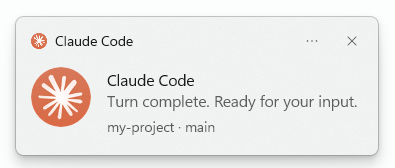

# claude-plugins

[](LICENSE)

A personal [Claude Code](https://code.claude.com) marketplace of independent plugins.

## Install

Add the marketplace, then install the plugins you want:

```text
/plugin marketplace add yura-okilka/claude-plugins

/plugin install toast-notify@yura-okilka
```

Test a plugin locally without publishing:

```text
claude --plugin-dir plugins/toast-notify
```

## Updating plugins

The `/plugin` menu has two update paths, and they behave differently:

- `/plugin` → **Marketplaces** → **Update marketplace** — pulls the latest plugin catalog
  from the repo immediately. This is the reliable way to get updates.
- `/plugin` → **Installed** → **Update now** — uses a local cache that can be stale and may
  not reflect recent changes. Use this as a fallback after updating the marketplace.

To keep plugins current automatically, enable `/plugin` → **Marketplaces** →
**Enable auto-update**, which refreshes the catalog on each session start. Each plugin is
versioned via the `version` field in its `plugin.json`; bumping it and pushing to `main` is
what publishes an update.

## Plugins

| Plugin | Description |
|--------|-------------|
| [toast-notify](#toast-notify) | Windows desktop notifications with click-to-focus. **Windows 10/11.** |

### toast-notify

Desktop notifications for Claude Code on Windows — so you can look away while Claude works
and get pinged the moment it needs you or finishes. **Click the notification to jump
straight back to the terminal that sent it.**

> **Works on Windows 10 and 11.** On macOS/Linux it simply has no effect (the hook can't
> run, and Claude Code ignores that) — safe to leave installed in a shared config.



**What you get:**

- A notification when **Claude needs your input** — like a permission prompt.
- A "turn complete" notification when **Claude finishes** — but only if you've clicked away,
  so you're not pinged while you're already watching.
- **Click it and the right terminal window comes to the front.** Works with Windows
  Terminal, the classic console, VS Code, and JetBrains IDEs.
- Each notification shows **which project and git branch** it came from (e.g.
  `my-project · main`), so you can tell sessions apart at a glance.

#### Good to know

- It focuses the **window**, not a specific tab — Windows has no way to switch to a
  particular terminal tab, so if Claude's session is in a background tab you'll land on the
  window and may need to click over to the tab.
- Bringing the window forward works in everyday use; once in a while Windows' focus rules
  flash the taskbar button instead of switching.

#### Uninstalling

Removing the plugin stops the notifications, but it leaves two `HKCU` registry entries the
script created at runtime — Claude Code has no on-uninstall hook, so they can't be removed
automatically. They're harmless (nothing runs once the hooks are gone), but to clear them
fully, run this in PowerShell:

```powershell
Remove-Item "HKCU:\Software\Classes\AppUserModelId\Claude.Code.Toast" -Recurse -Force
Remove-Item "HKCU:\Software\Classes\claudecode" -Recurse -Force
```

The first removes the leftover **Claude Code** entry from Windows notification settings; the
second removes the `claudecode:` click-to-focus protocol. Nothing else is left behind — no
files outside the plugin folder, no services or startup entries.

#### How it works (for the curious)

Everything runs through Claude Code's `Notification` and `Stop` hooks — no daemon, no
dependencies, nothing running between notifications. Each hook pipes its JSON payload to a
Windows PowerShell script on stdin.

**The toast.** `notify-toast.ps1` builds a native Windows toast via the WinRT
`ToastNotificationManager` (that's why it runs under `powershell.exe` 5.1, not `pwsh` 7). On
first run it registers an `AppUserModelId` under `HKCU\Software\Classes\AppUserModelId` so
the toast is attributed to **Claude Code** with the bundled icon. The `Stop` hook passes
`-OnlyIfUnfocused`, which suppresses the toast when the triggering terminal is already the
foreground window.

**Message text.** For `Notification` events the wording is Claude Code's own — it ships the
text (e.g. _"Claude is waiting for your input"_ or _"Claude needs your permission to use …"_)
in the payload's `message` field, and the script just relays it. `Stop` events carry no
message, so the script supplies its own _"Turn complete. Ready for your input."_ The
notification title is always **Claude Code**.

**Click-to-focus.** The toast is built with `activationType="protocol"` and a `launch` URI
like `claudecode:focus?hwnd=…&pid=…`, carrying the handle of the terminal that fired the hook
(found by walking the hook's parent process chain up to the first window-owning ancestor).
Clicking it invokes a `claudecode:` protocol handler registered in `HKCU`, which runs
`focus-launch.vbs` (a hidden launcher, so no console flash) → `focus-window.ps1`. That script
brings the window forward with `user32` P/Invoke — `SetForegroundWindow` plus the
`AttachThreadInput` trick to get past Windows' foreground lock — restoring it first if it was
minimized.

**Context line.** The `project · branch` line comes from the hook payload's `cwd` (leaf
folder) and `git rev-parse --abbrev-ref HEAD` — best-effort, omitted if it isn't a repo.

Files (under `plugins/toast-notify/`):

| File | What it does |
| ---- | ------------ |
| `hooks/hooks.json` | Registers the `Notification` and `Stop` hooks |
| `hooks/notify-toast.ps1` | Builds/shows the toast; registers the `AppUserModelId` + `claudecode:` protocol; finds the triggering window |
| `hooks/focus-window.ps1` | Brings a window to the foreground (`user32` P/Invoke + `AttachThreadInput` to beat the foreground lock) |
| `hooks/focus-launch.vbs` | Hidden launcher so clicking the toast causes no console flash |
| `hooks/claude.png` | The toast icon (96×96, circular) |

## License

MIT
